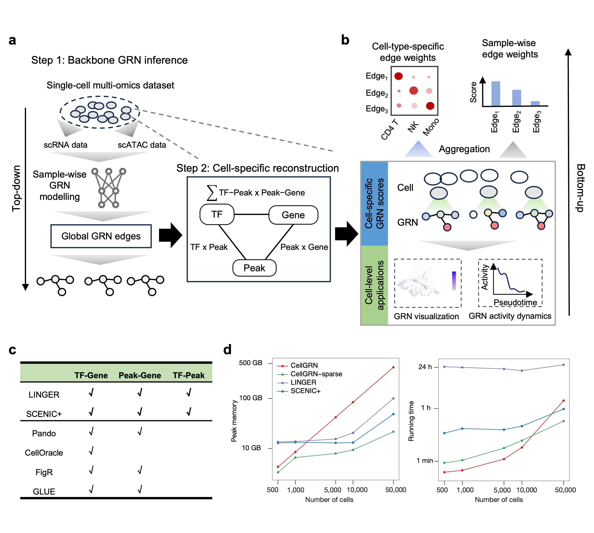

## CellGRN 


### Introduction

CellGRN is a framework that shifts the paradigm from global fitting to cell-specific reconstruction. CellGRN adopts a two-step strategy: it first leverages a global regulatory backbone from a global modeling strategy, and subsequently reconstructs cell-specific regulatory weights by projecting individual cell states onto this backbone.

CellGRN-sparse is an accelerated version of CellGRN, which skipped the step of cell-specific GRN output and optimized with sparse matrix and block computation.

All datasets can be downloaded from [FigShare](https://doi.org/10.6084/m9.figshare.31304758) or baidu Net Dist(https://pan.baidu.com/s/1mkpBOzyyuOHvmTPC4sMGBg?pwd=4r8v)

### Overview of CellGRN and CellGRN-sparse
----------------------------



### Pakcage dependencies
- Python >=3.8, scanpy, scikit-learn,pyranges,umap-learn, anndata,pandas, numpy, scipy, jupyter 
- Visualization requires extra matplotlib, seaborn and R>=3.5.


### Installation

If you have not installed python dependencies above, we recommend to use conda in install CellGRN in an independent environment. The conda tool (miniconda) can be installed  from [anaconda website](https://docs.anaconda.com/miniconda/miniconda-install/).</br>

- Step1: create a conda environment.

```Bash
conda env create -f cellgrn_env.yml -n cellgrn
conda activate cellgrn
```

2. Install cellgrn package.
```Bash
git clone https://github.com/DELTA-TJ-submission/CellGRN
# set dir to folder
cd cellgrn
pip install .
```
3. Test the installation in python
```python
import cellgrn
```
The installation typically take few minutes.

### Tutorial
A demo code for CellGRN and CellGRN-sparse [tutorial](./tutorial.ipynb)


### Repository structure
- [code/grn_method](code/grn_method/): SCENIC+ and LINGER GRN inference script.
- [code/preprocess](code/preprocess/): Preprocessing scripts for input datasets and validation datasets.
- [code/***_run.ipynb](code/): Reproducible scripts to run CellGRN in multiome/spatial-multiome datasets in our manuscript. 
    - [code/melanoma_run.ipynb](code/melanoma_run.ipynb): A step-by-step tutorial for CellGRN on a cell line dataset used in this study.
    - [code/scalability_run.ipynb](code/scalability_run.ipynb): Code for running time and memory assessment for different dataset sizes for CellGRN and CellGRN-sparse.
- [eval/***_eval.ipynb](eval/): Benchmark pipelines for each dataset.
- [eval/visualization/](eval/visualization/): R  scripts to plot figure in our manuscript.


## Reference
Cell-specific reconstruction improves gene regulatory network inference by resolving regulatory heterogeneity from single-cell multi-omics. (submited)
